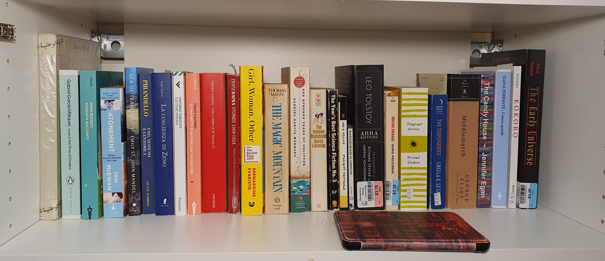
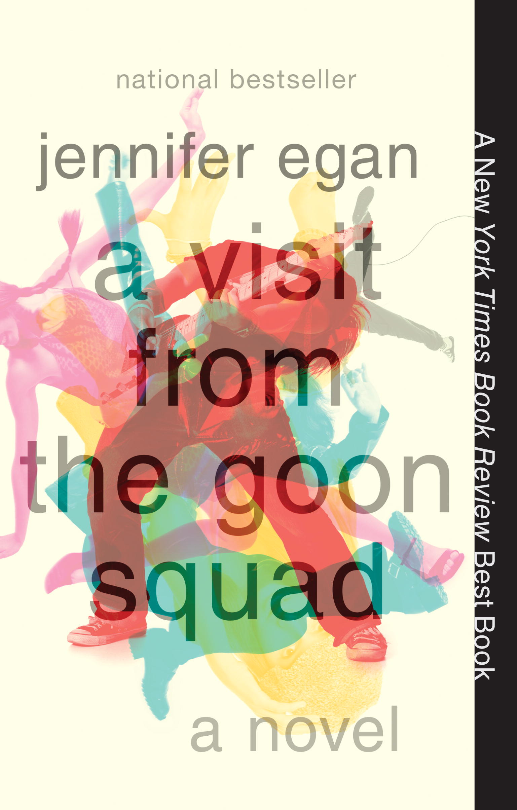
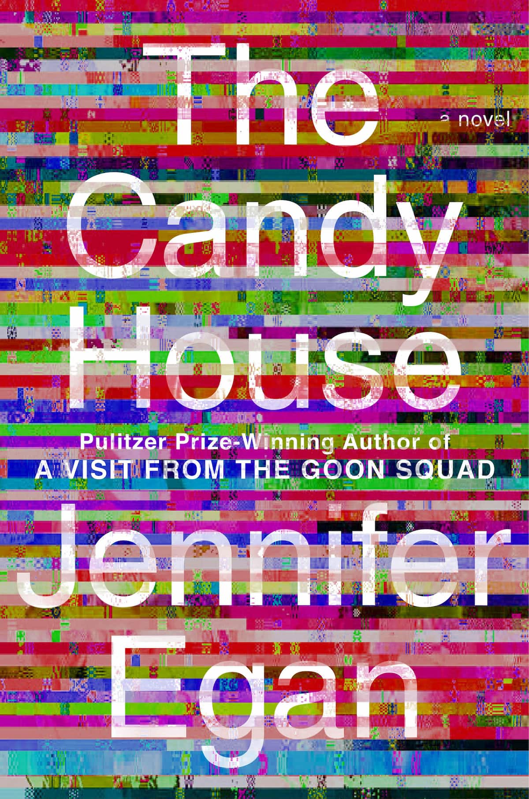

# Books

{align="center": style="height:1;width:100%"}

This is a recent snapshot of my bookshelf.

## Featured

Here are some books I have enjoyed recently.

  
  

Published in 2001 and 2022 respectively, _A Visit from the Goon Squad_ and _The Candy House_ by Jennifer Egan are both composed of a series of short stories, each told from the unique perspective of one of a complex web of interrelated characters. The first novel explores how the characters (and us!) change with time, while the second one focuses on the role of memories in our lives. The style is refreshingly experimental in both novels, with most chapters written in a distinctive style and going as far as a whole chapter composed of a PowerPoint slide, one as a magazine article, and one as a series of emails and messages! (which I found to be among the most impactful chapters of the books.)

Images taken from the author's [website](https://jenniferegan.com/books/a-visit-from-the-goon-squad/), where you will also find a link to the famous PowerPoint chapter from _Good Squad_.

