# Hiking

### Mont Saint-Bruno National Park near Montreal, October 2024

  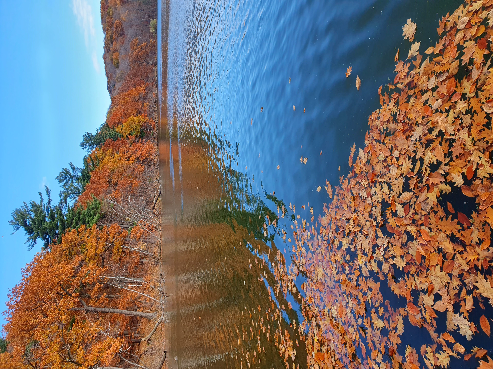
  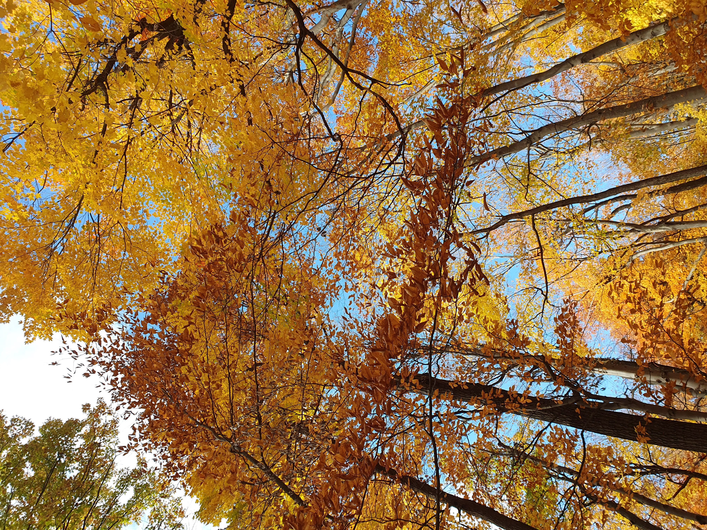
  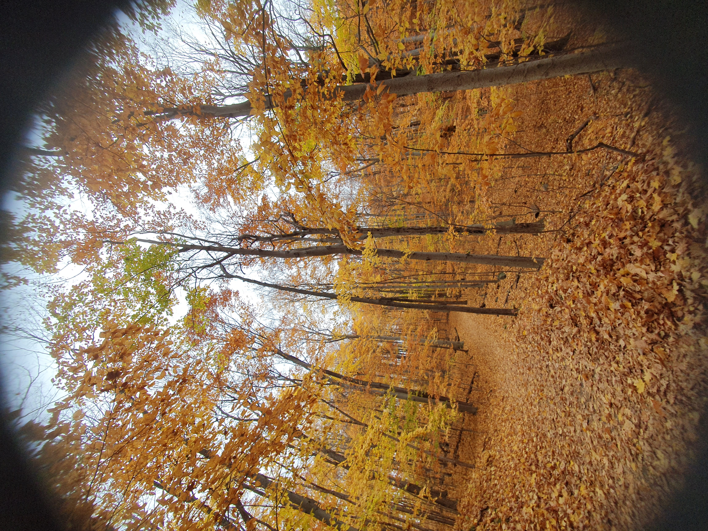

### Lac Monroe, Mont Tremblant National Park, Quebec, September 2024

  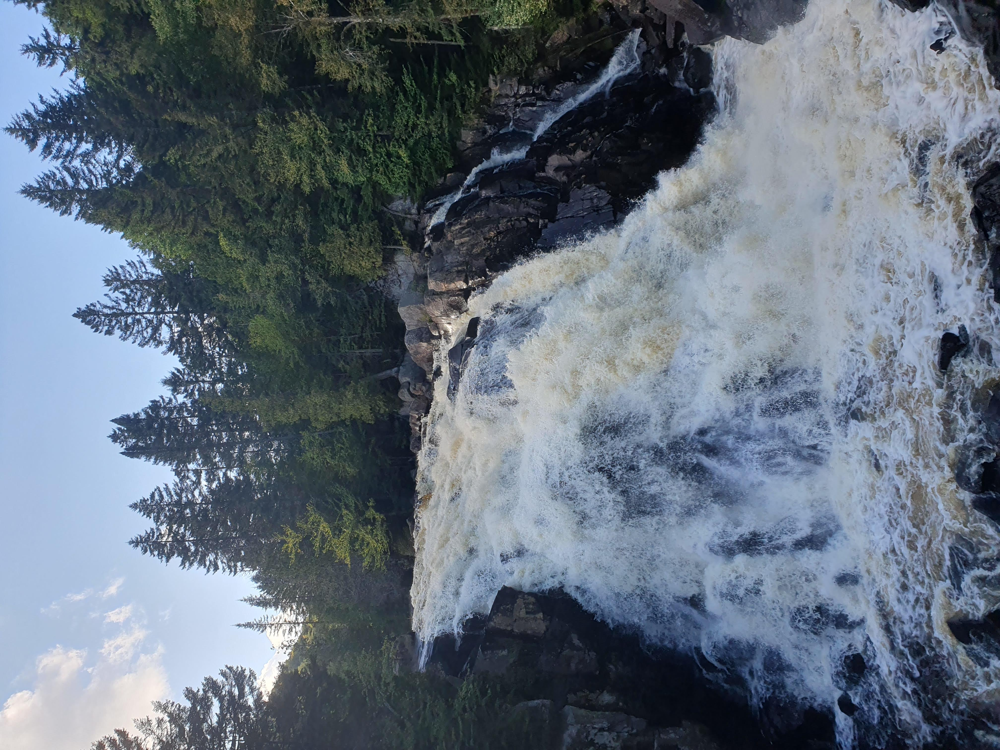
  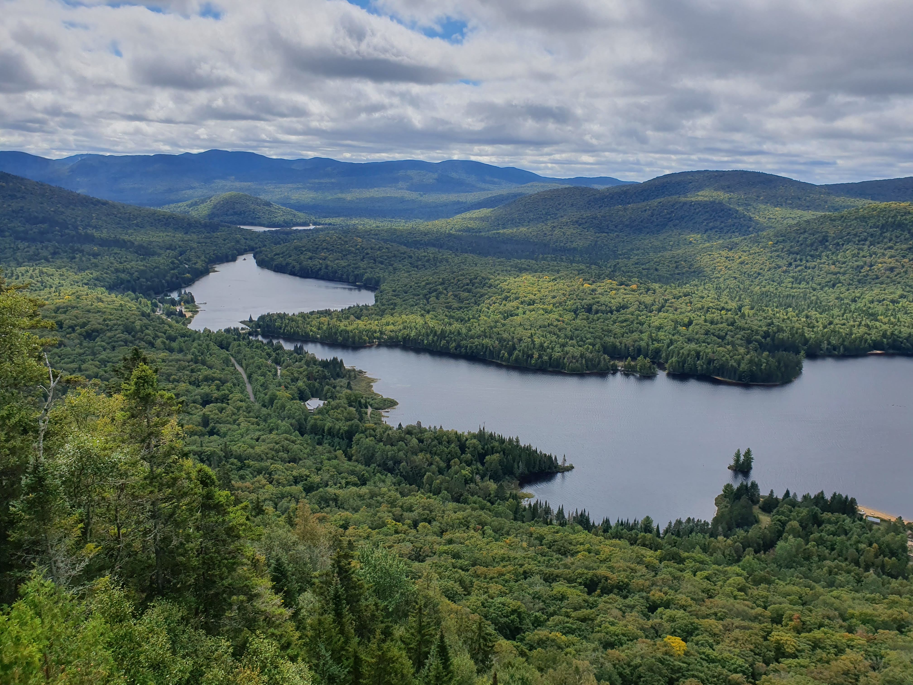
  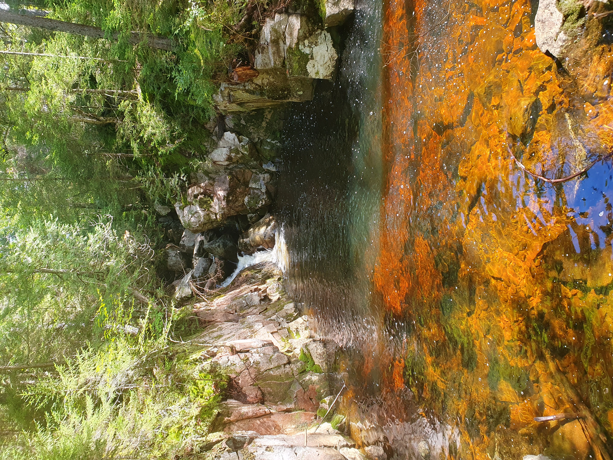

### Monte Grisa near Trieste, June 2024

  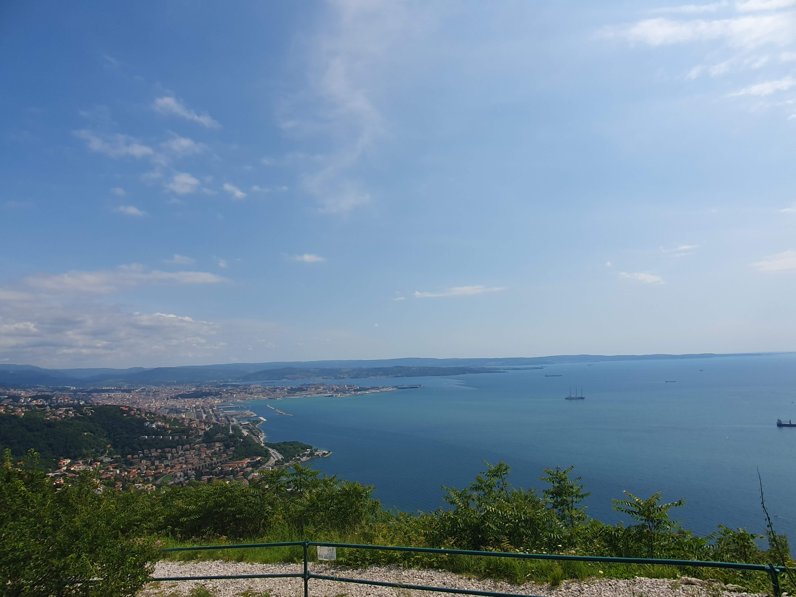
  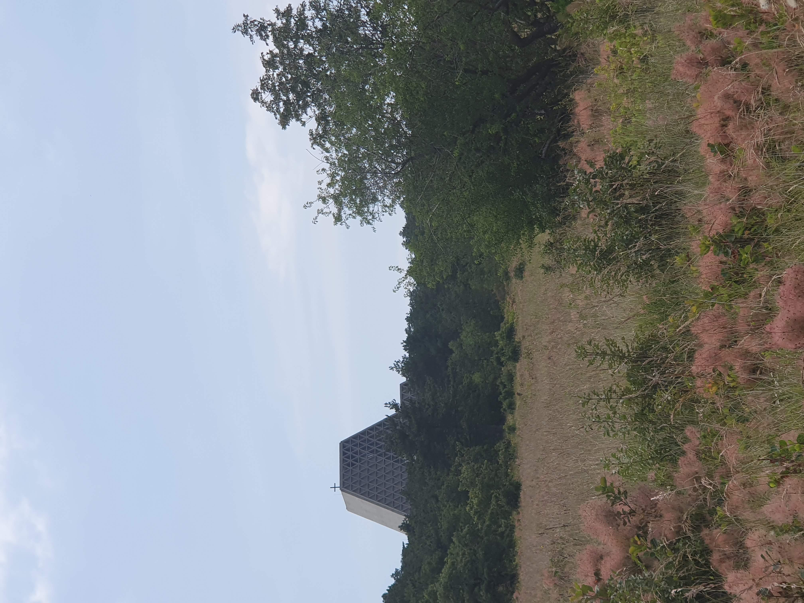
  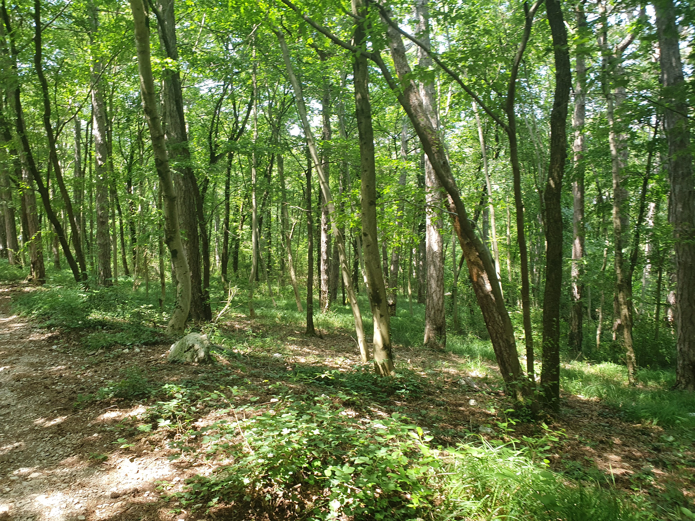

### Val Rosandra near Trieste, June 2024

  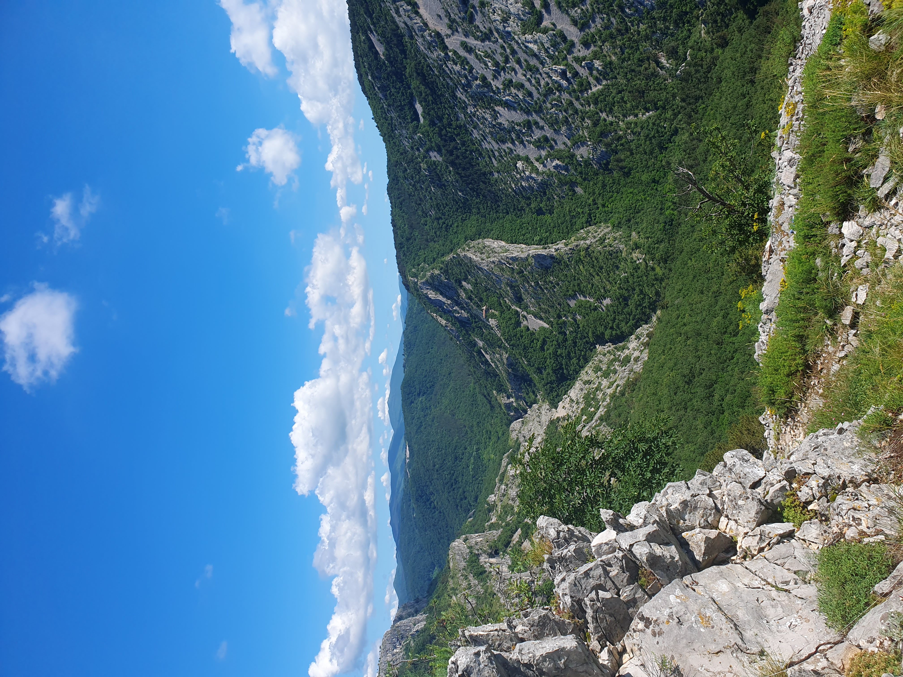
  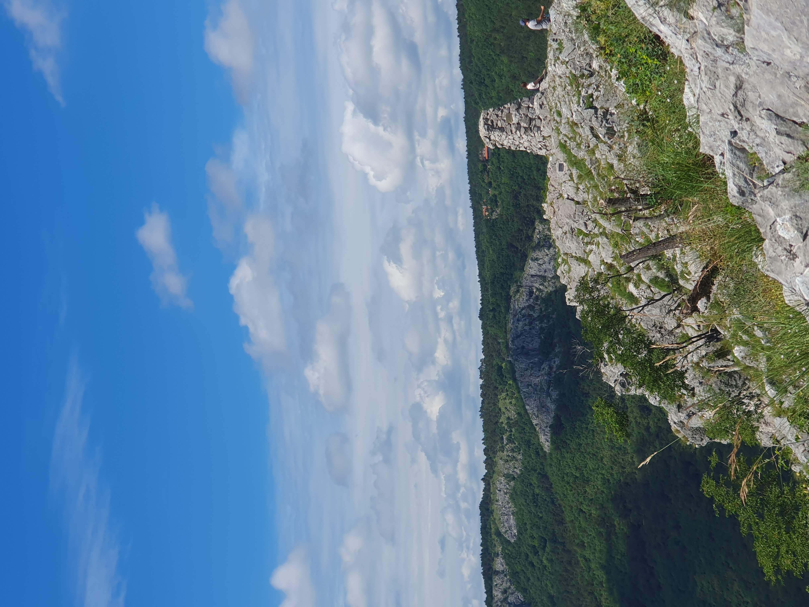
  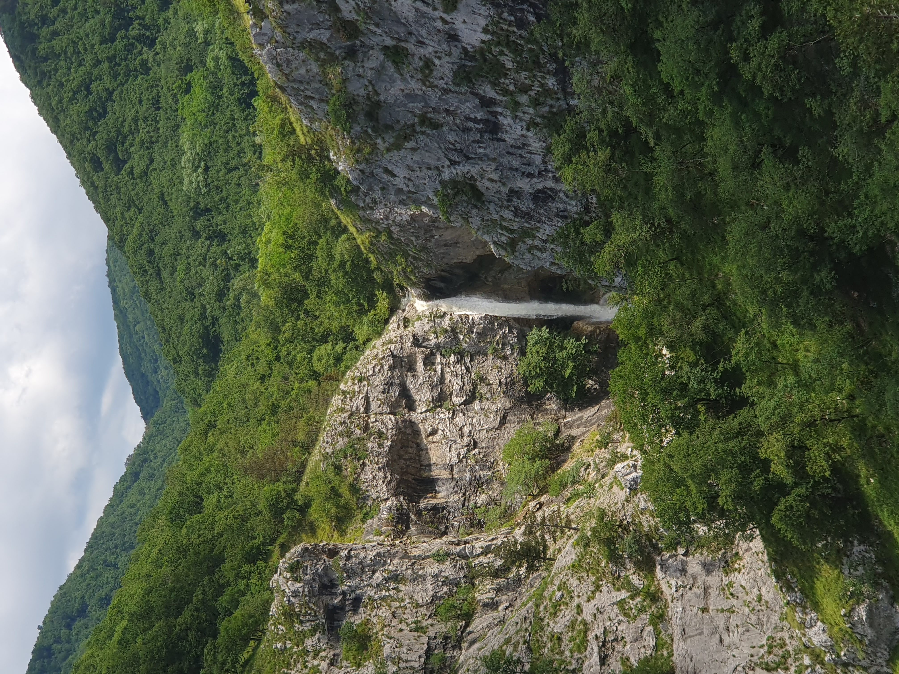

