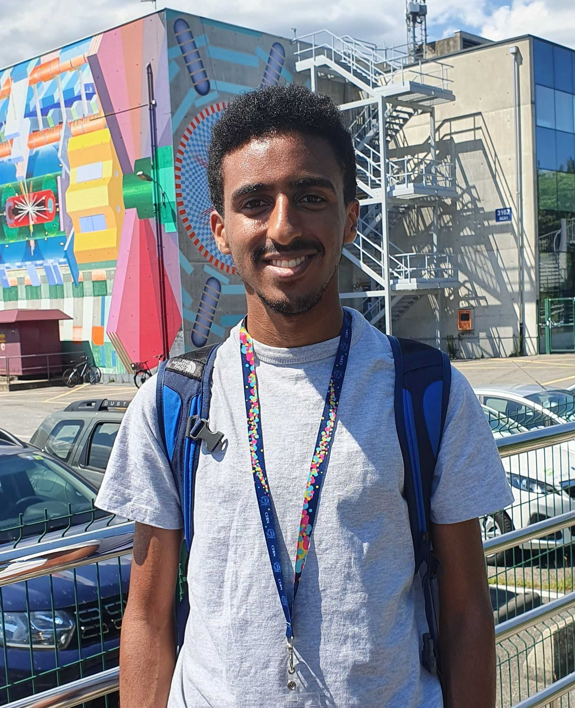

# Introduction

{align="left": style="height:400px"}

I joined Prof. Katelin Scutz's group at McGill University as a MSc student in 2024 after spending one year in the postgraduate program at the International Centre for Theoretical Physics in Trieste and completing my BSc at Khalifa University in the UAE in 2023. I am interested in the interface between particle physics and cosmology, and I am particularly excited about the potential to probe new physics through cosmological and astrophysical observations. You can read more about my current research interests [here](../research/index.md).

As a BSc student, I have worked on a variety of projects, ranging from computational solar astronomy to machine learning at LIGO to mathematical work on general relativity. You can find a summary of my past projects [here](../projects/index.md).

I am originally from Asmara, Eritrea, and I have moved around the world quite a bit before coming to Montreal. In my free time, I enjoy reading novels, watching football and F1, and going on long walks in nature.

# Other Interests

- [Cooking](./cooking.md)
- [Cycling](./cycling.md)
- [Olympic Fishing](./fishing.md)

# CV

<!-- How to embed a PDF -->
<iframe width="100%" height="600" src="./media/SWE_Resume_Template.pdf">