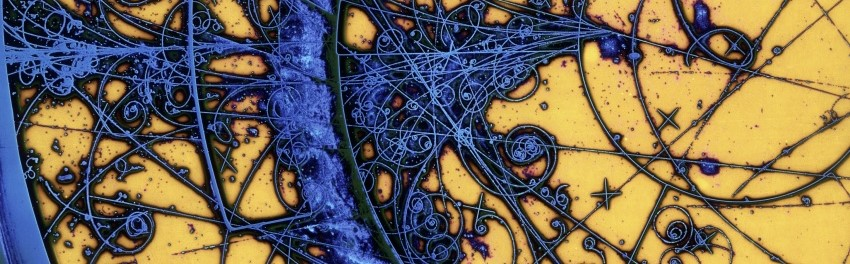
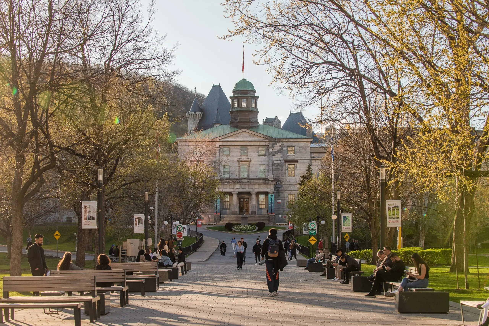

# Natnael Debru {align="center"}

{align="center": style="height:1;width:100%"}

  <a href="https://cds.cern.ch/record/39312" target="_blank">Bubble chamber with colour enhanced tracks, credits to CERN</a>

## Welcome to my research page!

I am a graduate student at McGill University, working with [Prof. Katelin Schutz](https://katelinschutz.com/) at the intersection between particle physics, astrophysics and cosmology.

If you'd like to learn more about me, you can find an introduction to [my research](./research/index.md), some info on my [outreach work](./outreach/index.md) and some more info [about me](./about/index.md).

The beautiful McGill campus. Image taken from [this McGill website](https://reporter.mcgill.ca/mcgill-ranks-among-worlds-best-universities-in-qs-rankings-by-subject/).